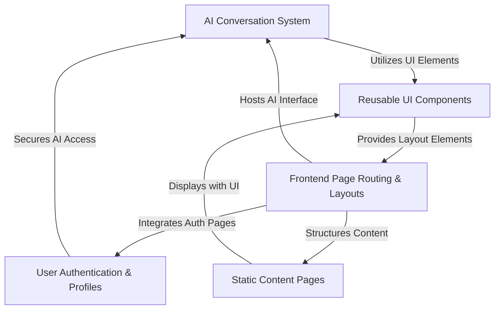
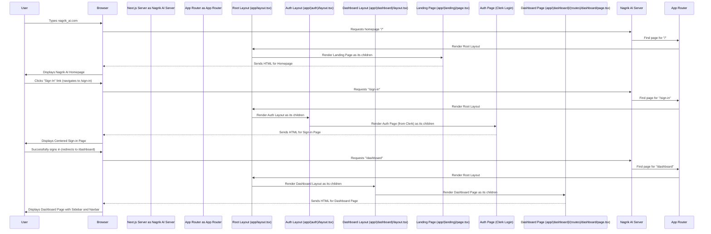
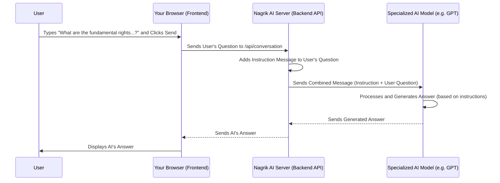
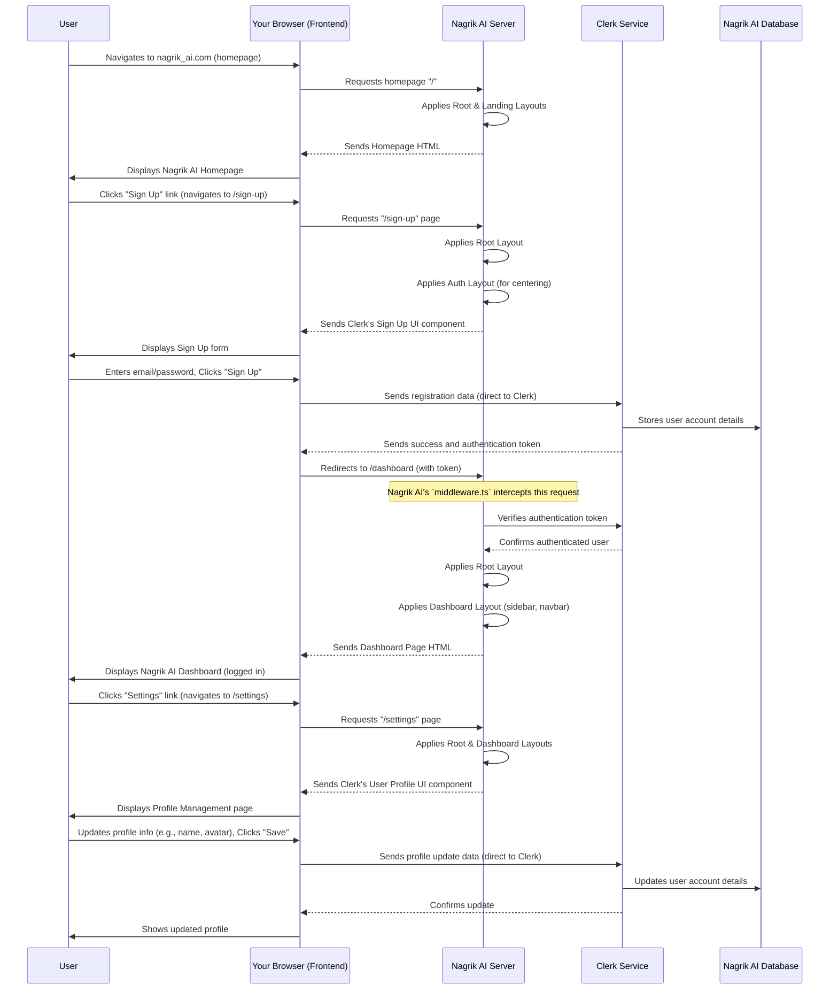
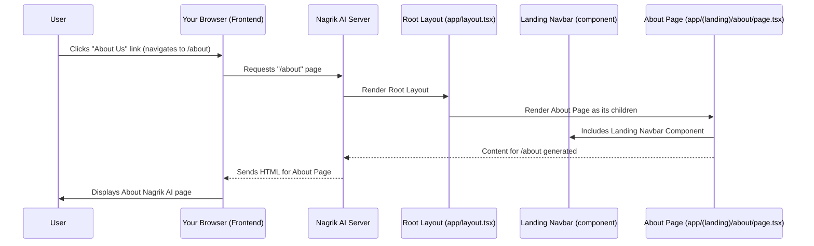
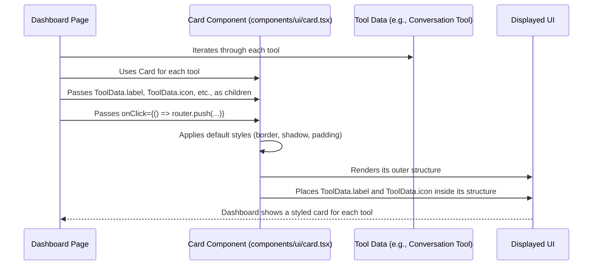

# Nagrik_AI

Nagrik AI is an **intelligent platform** designed to provide Indian citizens with *accurate and up-to-date information* on laws, government, and history. Users can interact with an **AI assistant** to get answers, manage their *personal profiles*, and access helpful static content like FAQs and privacy policies. The platform aims to empower citizens by making civic information easily accessible.


## Visual Overview



## Chapters

1. [Frontend Page Routing & Layouts
](01_frontend_page_routing___layouts_.md)
2. [AI Conversation System
](02_ai_conversation_system_.md)
3. [User Authentication & Profiles
](03_user_authentication___profiles_.md)
4. [Static Content Pages
](04_static_content_pages_.md)
5. [Reusable UI Components
](05_reusable_ui_components_.md)

---

# Chapter 1: Frontend Page Routing & Layouts

Welcome to the first chapter of our Nagrik AI journey! Have you ever wondered how websites organize their different sections? How do you go from a welcoming homepage to your personalized account dashboard, and why do some parts of the page, like the top navigation bar or a sidebar, stay the same while the main content changes?

This chapter is all about understanding the "architecture plan" of our Nagrik AI website. We'll explore two fundamental concepts: **Frontend Page Routing** and **Layouts**. Think of it like designing a building:

*   **Routing** is like creating the **hallways and signs** that guide people from one room (page) to another. It defines how users move through the building.
*   **Layouts** are like the **common features** of different sections – imagine how all offices might have a consistent ceiling and floor, even if the furniture inside changes. Or how the main lobby has a specific look that connects to all other areas.

By the end of this chapter, you'll understand how Nagrik AI uses these ideas to make a seamless and consistent experience for you, whether you're just browsing the public site or deeply engaged in your personal AI dashboard.

## What Problem Are We Solving?

Imagine Nagrik AI as a large digital city. This city has a bustling main square (our public homepage), quiet libraries (static content pages like "Privacy Policy"), and specialized workshops (the AI Conversation System in your dashboard).

**The problem:** Without a clear system, how do you:
1.  **Navigate** from the main square to a workshop?
2.  Ensure that all workshops have a **consistent entrance area** (like a shared reception desk or waiting room), even if the actual workshop machinery inside is different?

Frontend Page Routing solves the navigation problem, and Layouts solve the consistent appearance problem.

Let's use a common example:
A user visits Nagrik AI for the first time. They see the main welcome page. They then decide to sign in and, after a successful sign-in, are taken to their personal dashboard. Here, they'll see their tools, like the "Conversation" feature.

This journey involves moving between different "pages" and seeing different consistent "wrappers" around those pages.

## Key Concepts: Building Blocks of Our Website

### 1. Frontend Page Routing: Your Website's GPS

Routing is how your browser knows which "page" to show when you type an address (like `nagrik_ai.com/dashboard`) or click a link. In modern web applications like Nagrik AI, we use a concept called **file-system based routing**. This means the structure of our project folders directly maps to the URLs (web addresses) users see.

*   Every folder represents a part of the URL.
*   A special file named `page.tsx` inside a folder is the actual content for that specific URL.

Let's look at a simplified example from Nagrik AI's code:

```
app/
├── (auth)/             <-- A special folder for authentication pages
│   └── layout.tsx      <-- Layout for all authentication pages
├── (dashboard)/        <-- Another special folder for dashboard pages
│   ├── (routes)/       <-- Nested folder for dashboard routes
│   │   └── dashboard/
│   │       └── page.tsx <-- The actual Dashboard page content
│   └── layout.tsx      <-- Layout for all dashboard pages
├── (landing)/          <-- Special folder for the public landing page
│   └── page.tsx        <-- The actual Landing page content (homepage)
└── layout.tsx          <-- The main, overall layout for the ENTIRE website
```

In this structure:
*   `app/(landing)/page.tsx` becomes the content for the `/` (homepage) URL.
*   `app/(dashboard)/(routes)/dashboard/page.tsx` becomes the content for the `/dashboard` URL.

#### What are those `(parentheses)` folders?

You'll notice folders like `(auth)`, `(dashboard)`, and `(landing)`. These are called **Route Groups**. They are special folders that help us:
*   **Organize** our files better, grouping related pages.
*   Apply **specific layouts** to a group of pages *without* adding extra segments to the URL. For example, `/dashboard` does *not* become `/(dashboard)/dashboard`. It remains `/dashboard`. This keeps URLs clean while allowing different sections of the app to have different "shells."

### 2. Layouts: Consistent Design, Different Content

Layouts are like templates that wrap around your pages. They allow you to define common elements (like a navigation bar at the top, a sidebar on the left, or a footer at the bottom) that appear across multiple pages.

In Nagrik AI, layouts are defined in files named `layout.tsx`.

*   A `layout.tsx` file always receives a `children` prop. This `children` prop is where the actual page content (or another nested layout's content) will be placed.

Let's look at the different `layout.tsx` files in Nagrik AI:

#### The Root Layout: `app/layout.tsx`

This is the outermost wrapper for your entire website. It's like the foundation and main structure of our building. Every single page in Nagrik AI will pass through this layout.

```tsx
// app/layout.tsx
import "./globals.css"; // Basic styling for the entire app
import { ClerkProvider } from "@clerk/nextjs"; // For handling user login/signup

export default function RootLayout({
  children, // This is where all other pages and layouts will appear
}: {
  children: React.ReactNode;
}) {
  return (
    <ClerkProvider> {/* Sets up user authentication features */}
      <html lang="en">
        <body>{children}</body> {/* The main content area of your app */}
      </html>
    </ClerkProvider>
  );
}
```
**Explanation:** This `RootLayout` sets up essential, global things for Nagrik AI, like basic styling (`globals.css`) and the `ClerkProvider` which helps manage user logins and accounts. Every single part of our website, no matter which page it is, will be "inside" this `RootLayout`. The `children` prop acts as a placeholder for whatever page or layout is next.

#### Authentication Layout: `app/(auth)/layout.tsx`

This layout is specifically for pages related to user authentication, such as sign-in or sign-up. It provides a consistent, centered look for these important forms.

```tsx
// app/(auth)/layout.tsx
import React from 'react';

const AuthLayout: React.FC<{ children: React.ReactNode }> = ({ children }) => {
  return (
    <div className="flex items-center justify-center min-h-screen">
      {children} {/* This is where the actual sign-in/sign-up page content goes */}
    </div>
  );
};

export default AuthLayout;
```
**Explanation:** When you go to sign in or sign up for Nagrik AI, you'll see a form that's neatly centered on the page. This `AuthLayout` is responsible for that centering. It takes the actual login/signup content (the `children`) and places it within a container that ensures it's always in the middle of the screen.

#### Dashboard Layout: `app/(dashboard)/layout.tsx`

This layout is used for all pages *after* a user has logged in and is interacting with their personalized dashboard. It includes common dashboard elements like a sidebar navigation and a top navigation bar.

```tsx
// app/(dashboard)/layout.tsx
import Navbar from "@/components/navbar";    // The top navigation bar
import Sidebar from "@/components/sidebar";  // The left-hand navigation menu

const DasshBoardLayout =({
    children // This is where specific dashboard pages (like "Conversation") will go
})=>{
    return(
        <div className="h-full relative">
            <div className="hidden h-full md:flex md:w-72">
                <Sidebar/> {/* The sidebar for navigation */}
            </div>
            <main className="md:pl-72">
                <Navbar /> {/* The top navigation bar */}
                {children} {/* The specific content of the dashboard page */}
            </main>
        </div>
    );
}

export default DasshBoardLayout;
```
**Explanation:** Once you're logged into Nagrik AI, you'll always see a sidebar on the left and a navbar at the top. This `DasshBoardLayout` provides that consistent look and feel for all your personal dashboard pages. It wraps around specific pages like the main dashboard or the [AI Conversation System](02_ai_conversation_system_.md) page, providing a unified user experience.

#### Landing Page: `app/(landing)/page.tsx`

This is the specific page content for the public homepage. It uses components that are unique to the landing experience, like a hero section and testimonials.

```tsx
// app/(landing)/page.tsx
import { LandingNavbar } from "@/components/landing-navbar";
import { LandingHero } from "@/components/landing-hero";
// ... other components specific to the landing page

const LandingPage = () => {
  return (
    <div className="h-full">
      <LandingNavbar /> {/* The top bar for the public landing page */}
      <LandingHero />   {/* The big welcoming section */}
      {/* ... other content like features, testimonials */}
    </div>
  );
};

export default LandingPage;
```
**Explanation:** This file contains all the unique sections you see when you first visit Nagrik AI's website. It's the "welcome mat" of our digital city, showing off what the platform can do before you sign in.

#### Dashboard Page: `app/(dashboard)/(routes)/dashboard/page.tsx`

This file contains the specific content displayed on the main dashboard page after a user logs in. It lists tools and recent updates.

```tsx
// app/(dashboard)/(routes)/dashboard/page.tsx
"use client"; // This component needs features only available in the browser

import { useRouter } from "next/navigation"; // Tool to navigate between pages
import { Card } from "@/components/ui/card"; // A common UI element (like a box)

const DashboardPage = () => {
  const router = useRouter(); // Initialize navigation tool

  // Example list of tools
  const tools = [
    { label: "Conversation", href: "/conversation" },
  ];

  return (
    <div className="p-8"> {/* Padding around the content */}
      <h2 className="text-4xl font-bold text-center">
        Welcome to Nagrik AI Dashboard
      </h2>
      <p className="text-center">Discover powerful AI tools.</p>
      
      <div className="space-y-4">
        {tools.map((tool) => (
          <Card key={tool.href} onClick={() => router.push(tool.href)}>
            <div className="flex items-center gap-x-4">
              <div className="text-lg font-semibold">{tool.label}</div>
            </div>
          </Card>
        ))}
      </div>
      {/* ... more content like "Latest Updates" or "What Our Users Say" */}
    </div>
  );
};

export default DashboardPage;
```
**Explanation:** This is the actual content you see when you land on your dashboard. It displays things like the "Conversation" tool, recent updates, and user testimonials. When you click on a tool like "Conversation," the `router.push(tool.href)` command tells the website to take you to that specific page.

## How It All Works Together: Your Journey Through Nagrik AI

Let's trace the user journey we discussed earlier, from landing page to dashboard, to see how routing and layouts work hand-in-hand.

Imagine a user using Nagrik AI:



**Step-by-step walkthrough:**

1.  **Homepage Request:** When you type `nagrik_ai.com` (which maps to `/`), your browser asks the Nagrik AI server for the page.
2.  **Root Layout Applied:** The server, using Next.js's App Router, first applies the `app/layout.tsx` (the `RootLayout`). This ensures all global settings (like authentication support) are loaded.
3.  **Landing Page Renders:** Because the request was for `/` and it matches `app/(landing)/page.tsx`, the `LandingPage` content is rendered *inside* the `RootLayout`'s `children` area. You see the welcome page.
4.  **Sign In Request:** You click "Sign In," which usually leads to a path like `/sign-in` (managed by Clerk, our authentication provider, but handled by a page within the `(auth)` route group).
5.  **Auth Layout Applied:** The server again applies the `RootLayout`. Then, because the path is within the `(auth)` group, it applies the `app/(auth)/layout.tsx` (`AuthLayout`). This layout prepares the page to center its content.
6.  **Auth Page Renders:** The actual sign-in form (provided by Clerk, acting as the "page" content) is then rendered *inside* the `AuthLayout`'s `children` area. You see the centered login form.
7.  **Dashboard Request (After Login):** After a successful login, Nagrik AI automatically redirects you to `/dashboard`.
8.  **Dashboard Layout Applied:** Once more, the `RootLayout` is applied. Then, because the path is `/dashboard` (which belongs to the `(dashboard)` route group), the `app/(dashboard)/layout.tsx` (`DashboardLayout`) is applied. This layout sets up the sidebar and the top navigation bar.
9.  **Dashboard Page Renders:** Finally, the content of `app/(dashboard)/(routes)/dashboard/page.tsx` (`DashboardPage`) is rendered *inside* the `DashboardLayout`'s `children` area. You see your personalized dashboard with the sidebar and navbar.

This flow ensures that no matter where you are in Nagrik AI, the right "wrapper" (layout) is applied, and the correct "content" (page) is displayed, all while keeping the user experience consistent and easy to navigate!

## Conclusion

In this chapter, we've explored how Nagrik AI organizes its digital city using **Frontend Page Routing** and **Layouts**. You've learned that:
*   **Routing** directs users to the right "rooms" (pages) using a clever file-system structure, including special "route groups" for organization.
*   **Layouts** provide consistent "frames" around these pages, ensuring common elements like navigation bars or footers appear exactly where they should, creating a seamless user experience.

This fundamental architecture ensures that Nagrik AI is not just a collection of random pages, but a well-structured and user-friendly platform.

Next, we'll dive into one of the core features of Nagrik AI: how users can have intelligent conversations with our AI system. Get ready to explore the brains behind the platform!

[Next Chapter: AI Conversation System](02_ai_conversation_system_.md)

---

<sub><sup>Generated by [AI Codebase Knowledge Builder](https://github.com/The-Pocket/Tutorial-Codebase-Knowledge).</sup></sub> <sub><sup>**References**: [[1]](https://github.com/Uvesh-Multani/Nagrik_AI/blob/b94397e52c18739bbcb37e46e852e7e281b00740/app/(auth)/layout.tsx), [[2]](https://github.com/Uvesh-Multani/Nagrik_AI/blob/b94397e52c18739bbcb37e46e852e7e281b00740/app/(dashboard)/(routes)/dashboard/page.tsx), [[3]](https://github.com/Uvesh-Multani/Nagrik_AI/blob/b94397e52c18739bbcb37e46e852e7e281b00740/app/(dashboard)/layout.tsx), [[4]](https://github.com/Uvesh-Multani/Nagrik_AI/blob/b94397e52c18739bbcb37e46e852e7e281b00740/app/(landing)/page.tsx), [[5]](https://github.com/Uvesh-Multani/Nagrik_AI/blob/b94397e52c18739bbcb37e46e852e7e281b00740/app/layout.tsx)</sup></sub>

# Chapter 2: AI Conversation System

Welcome back to our journey through Nagrik AI! In [Chapter 1: Frontend Page Routing & Layouts](01_frontend_page_routing___layouts_.md), we learned how Nagrik AI organizes its digital space, guiding you seamlessly from one section to another and ensuring a consistent look and feel across different parts of the website. Think of it like a well-designed building with clear hallways and consistent room layouts.

Now, it's time to explore the *brain* of our Nagrik AI platform: the **AI Conversation System**. This is where the real magic happens – where you can ask questions about Indian laws, government, and history, and get intelligent, relevant answers.

## What Problem Are We Solving?

Imagine you have a burning question about a specific Indian law, or perhaps you want to know more about the history of the Indian government. Searching on the internet can sometimes lead to overwhelming and unverified information.

**The problem:** How can we provide you with quick, accurate, and reliable answers specifically about Indian civic information, without requiring you to sift through countless articles or complex legal documents?

**The solution:** The AI Conversation System acts like a highly knowledgeable virtual assistant, exclusively trained on Indian civic information. When you type a question into Nagrik AI, this system processes it, understands what you're asking, finds the best information from its specialized knowledge base, and then crafts a clear, concise answer.

Let's use a central example:

You, as a Nagrik AI user, want to know: "What are the fundamental rights in the Indian Constitution?"
You type this question into the AI chat interface. The AI Conversation System will then process your request and provide a detailed explanation of the fundamental rights, drawing only from its specialized knowledge about Indian law and the Constitution.

This chapter will guide you through how Nagrik AI handles this core use case, from your typed question to the AI's intelligent response.

## Key Concepts: How Nagrik AI Understands You

The AI Conversation System isn't just one big piece of code; it's a combination of different parts working together.

### 1. The User Interface (Frontend)

This is what you see and interact with – the chat box where you type your questions and the area where the AI's answers appear. It's built using the concepts we discussed in Chapter 1, ensuring it looks good and fits within the overall dashboard layout.

### 2. The Backend Logic (API)

This is the "engine room" of the conversation. When you type a question and hit "send," your question travels from the Frontend (your browser) to the Backend (Nagrik AI's server). The Backend then prepares your question, sends it to a powerful AI model, receives the answer, and sends it back to your browser to be displayed.

### 3. The Specialized AI Model

Nagrik AI doesn't just use *any* AI model. It uses a powerful **Large Language Model (LLM)** (like those from OpenAI), but with a crucial difference: it's given very specific instructions. This is like having a super-smart general knowledge assistant, but then giving it a special manual that says, "From now on, you are an expert *only* on Indian laws, government, and history. If anyone asks anything else, politely tell them it's outside your scope." This "manual" is called an **instruction message**.

### 4. The Instruction Message: Nagrik AI's Core Identity

This is the secret sauce! Before your question even reaches the powerful AI model, Nagrik AI's Backend adds a special "instruction message" to it. This message tells the AI:

*   "You are an AI assistant dedicated **exclusively** to providing comprehensive information on Indian legal matters, government, and history."
*   It lists specific topics like laws, regulations, government schemes, constitutional rights, legislative acts, historical details, etc.
*   Crucially, it also tells the AI: "If a user asks a question that falls outside these topics, respond by saying: 'This question is outside the scope of NAGRIK AI. Please ask about Indian legal matters, the Constitution, government-related information, or historical details about India's governance.' Do not provide answers to questions unrelated to these specific topics."

This instruction message ensures that Nagrik AI always stays focused on its mission and doesn't get sidetracked by general questions.

## How it All Works Together: Your Conversation with Nagrik AI

Let's trace our example: "What are the fundamental rights in the Indian Constitution?"



**Step-by-step walkthrough:**

1.  **You ask a question:** You type "What are the fundamental rights in the Indian Constitution?" into the chat box in your browser and press "Send."
2.  **Frontend sends to Backend:** Your browser (the Frontend) takes your question and sends it to a special address on the Nagrik AI server: `/api/conversation`. This is like sending a letter to the AI's "brain."
3.  **Backend prepares the message:** The Nagrik AI server (the Backend) receives your question. Before sending it to the powerful AI model, it adds the special **instruction message** we talked about. This ensures the AI stays focused on Indian civic information. So, the complete message sent to the AI model looks something like:
    *   "You are an AI assistant dedicated exclusively to providing comprehensive information on Indian legal matters..." (the instruction)
    *   "What are the fundamental rights in the Indian Constitution?" (your question)
4.  **Backend talks to the AI model:** The Nagrik AI server then sends this combined message to the powerful, general-purpose AI model (like one from OpenAI).
5.  **AI model generates an answer:** The AI model processes the combined message. Because of the strong instruction message, it knows to only respond with information relevant to Indian law. It then generates an answer about fundamental rights.
6.  **AI model sends back to Backend:** The AI model sends its generated answer back to the Nagrik AI server.
7.  **Backend sends to Frontend:** The Nagrik AI server receives the answer and sends it back to your browser.
8.  **Frontend displays the answer:** Your browser receives the answer and displays it in the chat interface, right below your question.

This entire process happens very quickly, giving you a seamless conversational experience!

## Inside the Code: Building the Conversation System

Let's look at the simplified code that makes this happen. We'll explore two main parts: the Frontend (what you see) and the Backend (the server-side logic).

### 1. The Frontend: `app/(dashboard)/(routes)/conversation/page.tsx`

This file is responsible for the user interface of the conversation page. Remember from [Chapter 1: Frontend Page Routing & Layouts](01_frontend_page_routing___layouts_.md), this page lives inside the `(dashboard)` route group, meaning it will always have the consistent sidebar and navbar around it.

Here's how it handles sending your message:

```tsx
// app/(dashboard)/(routes)/conversation/page.tsx (simplified)
"use client"; // This component runs in the user's browser

import { useState } from "react";
import axios from "axios"; // Tool to send requests to our server
import { useForm } from "react-hook-form"; // Helps manage input forms
// ... other imports for UI elements like Input, Button

// The main component for our conversation page
const ConversationPage = () => {
  const [messages, setMessages] = useState([]); // Stores all conversation messages

  // Setup our form with a single 'prompt' field
  const form = useForm({
    defaultValues: { prompt: "" },
  });

  const isLoading = form.formState.isSubmitting; // Is the form currently being sent?

  // Function called when you submit your question
  const onSubmit = async (values) => {
    try {
      // Create a message object for the user's question
      const userMessage = { role: "user", content: values.prompt };

      // Add user's message to the current list of messages
      const newMessages = [...messages, userMessage];
      setMessages(newMessages); // Optimistically update UI

      // Send the entire conversation history to our backend API
      const response = await axios.post("/api/conversation", {
        messages: newMessages,
      });

      // Add the AI's response to the messages
      setMessages((current) => [...current, response.data]);

      form.reset(); // Clear the input field
    } catch (error) {
      console.error(error); // Log any errors
    }
  };

  return (
    <div>
      {/* ... Heading and other UI elements ... */}
      <div>
        <form onSubmit={form.handleSubmit(onSubmit)}>
          {/* Input field for your question */}
          <input placeholder="Ask anything you want..." {...form.register("prompt")} />
          <button type="submit" disabled={isLoading}>Generate</button>
        </form>
      </div>
      <div className="space-y-4 mt-4">
        {/* Loader if AI is thinking, Empty state if no messages */}
        {/* Display all messages */}
        {messages.map((message, index) => (
          <div key={index}>
            {/* Show user's avatar for 'user' messages, bot's for 'assistant' */}
            <p>{message.role}: {message.content}</p> {/* Simplified display */}
          </div>
        ))}
      </div>
    </div>
  );
};

export default ConversationPage;
```
**Explanation:**
1.  **`useState<ChatCompletionMessageParam[]>([]);`**: This line creates a variable called `messages` that will hold all the messages in our conversation (both your questions and the AI's answers). When `setMessages` is called, the displayed conversation updates.
2.  **`useForm`**: This tool helps us easily create and manage the input field where you type your question (`prompt`).
3.  **`onSubmit` function**: This is the most important part!
    *   It first creates a `userMessage` object with your question.
    *   It then sends all current messages (including your new question) to our Backend API using `axios.post("/api/conversation", ...)`.
    *   Once the Backend sends back the AI's answer (`response.data`), it adds that answer to the `messages` list, and the screen updates to show both your question and the AI's reply.
4.  **`form` and `input`/`button`**: These are the actual UI elements. When you type in the `input` and click the `button`, the `onSubmit` function is triggered.
5.  **`messages.map(...)`**: This part loops through all the messages in our `messages` list and displays them on the screen, creating the chat-like interface.

### 2. The Backend: `app/api/conversation/route.ts`

This file is a special API route that lives on Nagrik AI's server. It's the "middleman" between your browser and the powerful AI model.

```tsx
// app/api/conversation/route.ts (simplified)
import { auth } from "@clerk/nextjs/server"; // For checking if user is logged in
import { NextResponse } from "next/server"; // To send responses back
import OpenAI from "openai/index.mjs"; // The library to talk to OpenAI's AI models

// Setup the OpenAI client using your secret key
const openai = new OpenAI({
  apiKey : process.env.OPENAI_API_KEY // Get the key securely from environment variables
});

// This is the CRUCIAL instruction message for Nagrik AI's specialization
const instructionMessage = {
    role: "system", // A "system" message tells the AI its role
    content:`You are an AI assistant dedicated exclusively to providing comprehensive information on Indian legal matters, including laws, regulations, government schemes, constitutional rights, legislative acts, and advocacy information. Additionally, you offer insights into the functioning of the Indian government, its history, including lists of Prime Ministers, Presidents, and other key government officials. You also provide detailed information on ministries, how the government operates, its past actions, rules and regulations, and other relevant details. If a user asks a question that falls outside these topics, respond by saying: 'This question is outside the scope of NAGRIK AI. Please ask about Indian legal matters, the Constitution, government-related information, or historical details about India's governance.' Do not provide answers to questions unrelated to these specific topics.`
}

// This function runs when your browser sends a POST request to /api/conversation
export async function POST (
    req: Request // The incoming request from the browser
) {
    try {
        const { userId } = auth(); // Check if the user is logged in

        // Get the messages (your question and previous conversation) from the request
        const body = await req.json();
        const { messages } = body;

        // Basic checks: is user logged in? are there messages? is OpenAI key set?
        if(!userId) { return new NextResponse("Unauthorized", { status: 401 }); }
        if(!process.env.OPENAI_API_KEY) { return new NextResponse("OpenAI API key is not set", { status: 500 }); }
        if(!messages) { return new NextResponse("Messages are required", { status: 400 }); }

        // Send the combined messages (instruction + user's conversation) to OpenAI
        const response = await openai.chat.completions.create({
            model: "gpt-3.5-turbo", // The specific AI model we're using
            messages:[instructionMessage,...messages] // Our instruction + user's conversation
        });

        // Send back the AI's first message to the browser
        return NextResponse.json(response.choices[0].message);

    } catch (error) {
        console.error("[CONVERSATION_ERROR]" ,error);
        return new NextResponse("Internal error", { status: 500});
    }
}
```
**Explanation:**
1.  **`auth()`**: This checks if the user making the request is actually logged in. It's an important security step.
2.  **`openai = new OpenAI(...)`**: This sets up the connection to the OpenAI service, using a secret key (`process.env.OPENAI_API_KEY`) that should never be publicly visible.
3.  **`instructionMessage`**: This is the detailed set of rules that makes Nagrik AI specialized. It's defined here and always sent to the AI model before the user's actual messages.
4.  **`export async function POST (req: Request)`**: This is the function that runs when the Frontend sends a request to `/api/conversation`.
5.  **`const { messages } = body;`**: This extracts the list of messages (your question and previous conversation turns) sent from the Frontend.
6.  **`openai.chat.completions.create(...)`**: This is the core call to the OpenAI service.
    *   `model: "gpt-3.5-turbo"`: Specifies which version of the AI model to use.
    *   `messages:[instructionMessage,...messages]`: This is critical! We send our `instructionMessage` *first*, followed by all the messages from the user's current conversation. This ensures the AI model always operates within the defined scope.
7.  **`return NextResponse.json(response.choices[0].message);`**: After the AI model provides an answer, this line sends just the AI's response back to the Frontend (your browser).

By combining these Frontend and Backend parts, Nagrik AI creates a powerful, specialized AI assistant dedicated to Indian civic information.

## Conclusion

In this chapter, we've peeled back the layers of Nagrik AI's **AI Conversation System**. You've learned that it's the "brain" of the platform, designed to understand your questions about Indian laws, government, and history, and provide relevant answers.

We explored how:
*   Your questions travel from the **Frontend** to the **Backend**.
*   The **Backend** acts as a clever coordinator, adding crucial "instruction messages" to keep the AI focused.
*   A powerful **AI model** processes these messages and generates intelligent responses.

This system ensures that Nagrik AI is not just a website, but a truly interactive and knowledgeable guide for Indian civic information.

Next, we'll shift our focus to how Nagrik AI manages users themselves – how you log in, how your profile is handled, and what options you have for personalization in [Chapter 3: User Authentication & Profiles](03_user_authentication___profiles_.md).

[Next Chapter: User Authentication & Profiles](03_user_authentication___profiles_.md)

---

<sub><sup>Generated by [AI Codebase Knowledge Builder](https://github.com/The-Pocket/Tutorial-Codebase-Knowledge).</sup></sub> <sub><sup>**References**: [[1]](https://github.com/Uvesh-Multani/Nagrik_AI/blob/b94397e52c18739bbcb37e46e852e7e281b00740/app/(dashboard)/(routes)/conversation/constants.ts), [[2]](https://github.com/Uvesh-Multani/Nagrik_AI/blob/b94397e52c18739bbcb37e46e852e7e281b00740/app/(dashboard)/(routes)/conversation/page.tsx), [[3]](https://github.com/Uvesh-Multani/Nagrik_AI/blob/b94397e52c18739bbcb37e46e852e7e281b00740/app/api/conversation/route.ts)</sup></sub>

# Chapter 3: User Authentication & Profiles

Welcome back to our journey through Nagrik AI! In [Chapter 2: AI Conversation System](02_ai_conversation_system_.md), we explored the "brain" of Nagrik AI, understanding how it processes your questions and provides specialized answers about Indian civic information. We saw how complex AI models work behind the scenes to give you accurate insights.

Now, let's talk about *you* – the user. How do you get access to this powerful AI? How does Nagrik AI know who you are and keep your information safe? This chapter is all about the "security guard" and "personal registry" of our application: **User Authentication & Profiles**.

## What Problem Are We Solving?

Imagine Nagrik AI as a members-only club where you can access exclusive tools like the AI Conversation System.

**The problem:** Without a robust system, how do we:
1.  **Identify** who is a member and who isn't?
2.  **Verify** members when they return?
3.  Ensure only **authorized members** can use the special tools?
4.  Allow members to **update their personal information** (like changing their password or profile picture)?
5.  Keep everyone's personal data **secure**?

**The solution:** The User Authentication & Profiles system. It's like having a very efficient security team at the club's entrance (for signing in/out) and a meticulous registry office inside (for managing your personal file).

Let's use a central example:

You, as a new user, want to try Nagrik AI.
1.  You first need to **Sign Up** to create your account.
2.  Later, you want to come back and continue using the AI. You need to **Sign In** to prove you are who you say you are.
3.  After logging in, you decide to change your email address or update your profile picture. You'll go to your **Profile Settings** to manage this information.

This chapter will guide you through how Nagrik AI handles these crucial steps, ensuring your account is secure and personalized.

## Key Concepts: Your Digital Identity

To manage user accounts effectively, Nagrik AI relies on a few core ideas:

### 1. User Authentication: Proving Who You Are

Authentication is the process of verifying a user's identity. It answers the question: "Are you really who you claim to be?"

*   **Sign Up (Registration):** This is when you create a new account. You provide some information (like your email and a password), and the system creates a new entry for you in its "member list."
*   **Sign In (Login):** This is when you return to the application. You provide your credentials (like your email and password), and the system checks if they match a known member. If they do, you're "authenticated" and allowed in.

### 2. User Profiles: Your Personal Details

Once you're authenticated, a user profile is where all your personal information is stored. Think of it as your personal file in the club's registry.

*   It holds details like your name, email, and any preferences you might set.
*   It allows you to manage these details, ensuring they are up-to-date.

### 3. Third-Party Authentication Service (Clerk): Our Expert Security Team

Building a secure and reliable authentication system from scratch is incredibly complex and risky. It involves handling passwords securely, managing user sessions, and protecting against various types of attacks.

Instead of building this ourselves, Nagrik AI uses a specialized third-party service called **Clerk**. Think of Clerk as hiring a professional security company for our club.

**Why use Clerk?**
*   **Security:** Clerk specializes in authentication, implementing industry best practices to keep your data safe. We don't have to worry about the nitty-gritty of password encryption or session management.
*   **Ease of Use:** Clerk provides ready-made "building blocks" (like sign-up forms, sign-in forms, and profile management pages) that we can easily plug into our application. This saves a lot of development time.
*   **Robust Features:** Clerk offers features like social logins (e.g., "Sign in with Google"), multi-factor authentication, and user management dashboards, all out-of-the-box.

By using Clerk, Nagrik AI can focus on its core mission (providing AI-powered civic information) while outsourcing the complex task of user security to experts.

## How It All Works Together: Your Account Journey

Let's trace our example user journey: signing up, logging in, and managing your profile.



**Step-by-step walkthrough:**

1.  **Initial Visit & Sign Up:**
    *   You visit Nagrik AI's homepage. When you click "Sign Up," your browser requests the `/sign-up` page from the Nagrik AI server.
    *   The Nagrik AI server uses its layouts (the `RootLayout` and `AuthLayout` we saw in [Chapter 1: Frontend Page Routing & Layouts](01_frontend_page_routing___layouts_.md)) to wrap the content.
    *   Crucially, the "page content" for `/sign-up` is actually a pre-built Sign Up form provided by Clerk. This form is sent to your browser.
    *   When you fill out the form and submit it, your browser sends your registration details *directly* to Clerk. Clerk handles all the secure storage of your password and user data in its own system (which integrates with Nagrik AI's database for user IDs).
    *   Once registered, Clerk tells your browser to redirect you to the `/dashboard` page, and also provides an authentication "token" that proves you're now logged in.

2.  **Accessing the Dashboard (Protected Route):**
    *   Your browser requests the `/dashboard` page.
    *   Before Nagrik AI's server even processes this request, a special "security guard" called `middleware.ts` (we'll look at this soon) steps in. This middleware talks to Clerk to verify that the authentication token from your browser is valid.
    *   If the token is valid, the `middleware` allows the request to proceed. Nagrik AI then applies the `RootLayout` and `DashboardLayout` (with the sidebar and navbar), and sends you the dashboard content.
    *   If the token were invalid (e.g., you weren't logged in), the middleware would stop the request and redirect you to the sign-in page!

3.  **Managing Your Profile:**
    *   From the dashboard, you click "Settings," which takes you to the `/settings` page.
    *   Similar to sign-up/sign-in, this page also uses a pre-built component from Clerk: the `UserProfile` component.
    *   This component allows you to view and edit your profile details. Any changes you make are sent directly from your browser to Clerk, which then updates your information securely.

This streamlined process, powered by Clerk, ensures that Nagrik AI's user authentication and profile management are both secure and easy to use.

## Inside the Code: Implementing Authentication with Clerk

Let's look at the simplified code that integrates Clerk into Nagrik AI.

### 1. The Global Setup: `app/layout.tsx`

For Clerk to work across our entire application, its main "provider" needs to wrap everything. This happens in the main `app/layout.tsx` file, which is the "Root Layout" for the whole website (as we learned in [Chapter 1: Frontend Page Routing & Layouts](01_frontend_page_routing___layouts_.md)).

```tsx
// app/layout.tsx (simplified)
import { ClerkProvider } from "@clerk/nextjs";

export default function RootLayout({
  children, // All other pages/layouts will be placed here
}) {
  return (
    <ClerkProvider> {/* This wraps our entire application with Clerk's features */}
      <html lang="en">
        <body>{children}</body>
      </html>
    </ClerkProvider>
  );
}
```
**Explanation:**
The `ClerkProvider` component acts like a master switch. By wrapping our entire application (`{children}`), it makes all of Clerk's authentication and user management features available to every part of Nagrik AI. Without this, no other Clerk components would work.

### 2. Sign Up & Sign In Pages: `app/(auth)/.../page.tsx`

These are the actual pages users see when they want to create an account or log in. Nagrik AI simply uses Clerk's ready-made UI components. These pages are placed inside the `(auth)` route group to get the consistent centered `AuthLayout`.

**Sign In Page (`app/(auth)/(routes)/sign-in/[[...sign-in]]/page.tsx`):**
```tsx
// app/(auth)/(routes)/sign-in/[[...sign-in]]/page.tsx
import { SignIn } from '@clerk/nextjs'; // Import Clerk's Sign In component

export default function Page() {
  return <SignIn />; // Render Clerk's pre-built Sign In form
}
```
**Explanation:**
This code is incredibly simple! It just imports the `SignIn` component from Clerk and renders it. Clerk provides all the HTML, CSS, and JavaScript needed for a secure and functional login form. Nagrik AI doesn't need to write any login logic itself.

**Sign Up Page (`app/(auth)/(routes)/sign-up/[[...sign-up]]/page.tsx`):**
```tsx
// app/(auth)/(routes)/sign-up/[[...sign-up]]/page.tsx
import { SignUp } from '@clerk/nextjs'; // Import Clerk's Sign Up component

export default function Page() {
  return <SignUp />; // Render Clerk's pre-built Sign Up form
}
```
**Explanation:**
Just like the Sign In page, the Sign Up page also imports and renders a ready-made component from Clerk. This ensures a consistent and secure registration process without custom development.

### 3. Protecting Routes: `middleware.ts`

This file is our "security guard" for the entire application. It runs for almost every request and decides if a user is allowed to access a particular page.

```typescript
// middleware.ts (simplified)
import { clerkMiddleware, createRouteMatcher } from '@clerk/nextjs/server';

// Define which routes are "public" (can be accessed without logging in)
const isPublicRoute = createRouteMatcher([
  '/sign-in(.*)', // Sign in page
  '/sign-up(.*)', // Sign up page
  '/',             // Homepage
  '/privacy',      // Privacy Policy page
  '/term',         // Terms of Service page
  // ... other public static content pages
]);

// This is the core middleware function
export default clerkMiddleware((auth, req) => {
  if (!isPublicRoute(req)) {
    // If the requested route is NOT public, then protect it
    auth().protect(); // Clerk will check if the user is logged in
  }
});

export const config = {
  // Define which routes the middleware should apply to
  matcher: [
    // Apply to all routes except internal Next.js files and static assets
    '/((?!_next|[^?]*\\.(?:html?|css|js(?!on)|jpe?g|webp|png|gif|svg|ttf|woff2?|ico|csv|docx?|xlsx?|zip|webmanifest)).*)',
    // Apply to all API routes as well
    '/(api|trpc)(.*)',
  ],
};
```
**Explanation:**
1.  **`createRouteMatcher` and `isPublicRoute`**: This sets up a list of paths that anyone can visit, even if they're not logged in (like the homepage, sign-up, privacy policy, etc.).
2.  **`clerkMiddleware((auth, req) => { ... })`**: This is the main function. For every incoming request (`req`), it checks if the requested path is *not* in our `isPublicRoute` list.
3.  **`auth().protect()`**: If the route is *not* public, this command tells Clerk to "protect" it. Clerk then automatically checks if there's a logged-in user. If there isn't, Clerk will redirect the user to the sign-in page. This ensures that only authenticated users can access areas like the dashboard or AI conversation system.
4.  **`matcher`**: This `config` tells Next.js *when* to run this middleware, making sure it applies to most of our application's pages and API routes, but skips things like image files or internal Next.js assets.

### 4. User Profile Settings: `app/(dashboard)/(routes)/settings/[[...settings]]/page.tsx`

Once logged in, users can manage their profile details. This page is located within the `(dashboard)` route group, meaning it will have the consistent sidebar and navbar around it.

```tsx
// app/(dashboard)/(routes)/settings/[[...settings]]/page.tsx (simplified)
import { UserProfile } from '@clerk/nextjs'; // Import Clerk's User Profile component

const SettingsPage = () => {
    return (
        <div>
            {/* ... (Heading component for title) ... */}
            <div>
                <h2>Update Profile</h2>
                {/* This component provides a full UI for profile management */}
                <UserProfile routing="hash" /> 
            </div>
        </div>
    );
}

export default SettingsPage;
```
**Explanation:**
Similar to the sign-in/sign-up pages, this `SettingsPage` simply imports and renders Clerk's `UserProfile` component. This component automatically provides a user interface where logged-in users can update their name, email, profile picture, security settings, and more, all managed securely by Clerk. The `routing="hash"` prop helps it work smoothly within our application's routing.

## Conclusion

In this chapter, we've explored the critical role of **User Authentication & Profiles** in Nagrik AI. You've learned that:
*   This system acts as the "security guard" and "personal registry" for the application.
*   It handles everything from **signing up** new users and **signing in** returning users to allowing users to **manage their personal profiles**.
*   Nagrik AI leverages a powerful third-party service called **Clerk** to provide robust, secure, and easy-to-implement authentication and user management features.
*   We've seen how `ClerkProvider`, Clerk's UI components, and the `middleware.ts` file work together to protect Nagrik AI's personalized features and keep user information secure.

By outsourcing complex security tasks to Clerk, Nagrik AI can focus on delivering its core value: intelligent civic information.

Next, we'll shift our focus to the simpler, non-interactive pages of Nagrik AI, like "Privacy Policy" or "About Us," in [Chapter 4: Static Content Pages](04_static_content_pages_.md).

[Next Chapter: Static Content Pages](04_static_content_pages_.md)

---

<sub><sup>Generated by [AI Codebase Knowledge Builder](https://github.com/The-Pocket/Tutorial-Codebase-Knowledge).</sup></sub> <sub><sup>**References**: [[1]](https://github.com/Uvesh-Multani/Nagrik_AI/blob/b94397e52c18739bbcb37e46e852e7e281b00740/app/(auth)/(routes)/sign-in/[[...sign-in]]/page.tsx), [[2]](https://github.com/Uvesh-Multani/Nagrik_AI/blob/b94397e52c18739bbcb37e46e852e7e281b00740/app/(auth)/(routes)/sign-up/[[...sign-up]]/page.tsx), [[3]](https://github.com/Uvesh-Multani/Nagrik_AI/blob/b94397e52c18739bbcb37e46e852e7e281b00740/app/(dashboard)/(routes)/settings/[[...settings]]/page.tsx), [[4]](https://github.com/Uvesh-Multani/Nagrik_AI/blob/b94397e52c18739bbcb37e46e852e7e281b00740/app/layout.tsx), [[5]](https://github.com/Uvesh-Multani/Nagrik_AI/blob/b94397e52c18739bbcb37e46e852e7e281b00740/middleware.ts)</sup></sub>

# Chapter 4: Static Content Pages

Welcome back to our journey through Nagrik AI! In [Chapter 3: User Authentication & Profiles](03_user_authentication___profiles_.md), we learned how Nagrik AI securely manages user accounts, from signing up to personalizing your profile. We saw how a dedicated service like Clerk handles the complex task of proving who you are, keeping your information safe.

Now, let's explore a different kind of page on the Nagrik AI platform – pages that are not about your personal dashboard or AI conversations. These are like the "information brochures" or "guidebooks" of the Nagrik AI platform: **Static Content Pages**.

## What Problem Are We Solving?

Imagine visiting a new website. Before you even think about signing up or using its main features, you probably want to know: "What is this website about?", "Is it trustworthy?", or "How can I contact them?".

**The problem:** Not every piece of information on a website needs a complex AI brain or a personalized user account. We need a simple, efficient way to provide essential, mostly unchanging information that applies to everyone, whether they're logged in or just browsing.

**The solution:** Static Content Pages. These pages are designed to deliver fixed information directly. They are crucial for:
*   **Informing visitors:** Giving them a quick overview of the project.
*   **Building trust:** Providing transparent information like privacy policies.
*   **Offering support:** Allowing users to submit feedback or find answers to common questions.

Let's use a central example:

You are a new visitor to Nagrik AI.
1.  You want to understand **"What is Nagrik AI?"** You'd look for an "About Us" page.
2.  You have a quick question like "Is Nagrik AI free?" You'd check an **"FAQ" (Frequently Asked Questions)** page.
3.  You want to ensure your data is safe. You'd read the **"Privacy Policy"**.

These pages contain content that rarely changes and is the same for every visitor. They are "static" because their content isn't generated dynamically for each user or through complex calculations.

## Key Concepts: Fixed Information for Everyone

Static Content Pages are fundamental for any website. Here's what makes them special in Nagrik AI:

### 1. "Static" Content

When we say "static," we mean that the *content* of the page is generally fixed and does not change based on who is viewing it, what time it is, or what dynamic data is pulled from a database. It's like reading a page in a printed book – the words are always the same.

Common examples in Nagrik AI include:
*   **About Us:** Explains what Nagrik AI is, its mission, and team.
*   **FAQ (Frequently Asked Questions):** Provides answers to common queries.
*   **Privacy Policy:** Details how user data is collected, used, and protected.
*   **Terms of Service:** Outlines the rules and agreements for using the platform.
*   **Feedback:** A form for users to submit comments or suggestions.

### 2. Client-Side Interactivity (Optional but Common)

While the *content* itself is static, a static content page can still have some interactive elements that run in your browser (client-side). For example:
*   An FAQ page might have expandable sections (accordions) where you click to reveal an answer.
*   A feedback page will have a form where you type information and click a submit button. This form might send data to a backend, but the form's structure and the page's overall information are fixed.

These interactive elements enhance the user experience without making the core content dynamic or personalized.

### 3. Leveraging Layouts from Chapter 1

Just like our dynamic pages (homepage, dashboard), static content pages still benefit from the **Layouts** we discussed in [Chapter 1: Frontend Page Routing & Layouts](01_frontend_page_routing___layouts_.md). This ensures a consistent look and feel across the entire website. For our static content pages, they typically use the `LandingNavbar` to maintain a unified public-facing appearance.

## How it All Works Together: Displaying a Static Page

Let's trace how Nagrik AI displays an "About Us" page.



**Step-by-step walkthrough:**

1.  **You request a static page:** You click on an "About Us" link, which points to the `/about` URL.
2.  **Browser sends request:** Your browser sends a request to the Nagrik AI server for the `/about` page.
3.  **Server applies Root Layout:** The Nagrik AI server, using Next.js's App Router, first applies the `app/layout.tsx` (the `RootLayout`). This ensures global settings like styling are consistent.
4.  **Specific page content is rendered:** Because the request was for `/about`, the content from `app/(landing)/about/page.tsx` is rendered. This page specifically includes the `LandingNavbar` component to provide the consistent header seen on public pages.
5.  **HTML sent to browser:** The server generates the complete HTML for the "About Us" page (including the navigation bar and the "About Us" content) and sends it back to your browser.
6.  **Page is displayed:** Your browser receives the HTML and displays the "About Nagrik AI" page to you.

The process is straightforward because the server doesn't need to fetch data or perform complex calculations for the content – it just retrieves and presents the pre-defined information.

## Inside the Code: Building Static Pages

Let's look at simplified code examples for different types of static content pages. All these pages live within the `(landing)` route group, which means they will automatically inherit the `RootLayout` and typically include a `LandingNavbar` to match the public-facing design.

### 1. "About Us" Page (`app/(landing)/about/page.tsx`)

This is a very common static page. It provides information about the project without any interactive elements beyond basic links or images.

```tsx
// app/(landing)/about/page.tsx (simplified)
import { LandingNavbar } from "@/components/landing-navbar";
import Image from "next/image"; // For optimized image display

const About = () => {
  return (
    <>
      <div className="min-h-screen flex flex-col">
        <LandingNavbar /> {/* Consistent navigation bar */}
        <section className="py-16">
          <div className="container mx-auto px-4">
            <h1 className="text-4xl font-bold text-gray-800 mb-6 text-center">
              About Nagrik AI
            </h1>
            <p className="text-gray-600 text-center">
              NAGRIK AI is a specialized platform designed to empower Indian citizens...
            </p>
            {/* ... more text about mission, values, team, images ... */}
            <div className="grid gap-8 md:grid-cols-4 text-center mt-16">
              <div className="rounded-lg p-8 bg-[#f6f5f5] border">
                <h2 className="text-2xl font-bold">30+</h2>
                <p className="text-gray-600 mt-2">Citizens Empowered</p>
              </div>
              {/* ... other statistics ... */}
            </div>
          </div>
        </section>
      </div>
    </>
  );
};

export default About;
```
**Explanation:**
*   **`LandingNavbar`**: This component, defined in `src/components/landing-navbar.tsx` (a [Reusable UI Component](05_reusable_ui_components_.md)), ensures the navigation bar at the top of the page is consistent with the rest of the public site.
*   **Content Sections**: The rest of the page is purely content (`h1`, `p` tags, `div`s for layout and styling) along with images. There's no data being fetched, no user input logic, just information presented in a structured way.

### 2. "Frequently Asked Questions" (FAQ) Page (`app/(landing)/faq/page.tsx`)

An FAQ page often includes a simple interactive element like an accordion, where users can click to expand or collapse answers. Even with this, the questions and answers themselves are "static."

```tsx
// app/(landing)/faq/page.tsx (simplified)
"use client"; // This component runs in the user's browser for interactivity

import { useState } from "react";
import { LandingNavbar } from "@/components/landing-navbar";
import { ChevronDown, ChevronUp } from "lucide-react"; // Icons

const Faq = () => {
  const [openFAQ, setOpenFAQ] = useState<number | null>(null); // State to track open FAQ

  const toggleFAQ = (index: number) => {
    setOpenFAQ(openFAQ === index ? null : index); // Toggle open/close
  };

  const faqs = [
    { question: "What is Nagrik AI?", answer: "Nagrik AI is a specialized platform..." },
    { question: "How can I use Nagrik AI?", answer: "You can use Nagrik AI by..." },
    // ... more FAQ items
  ];

  return (
    <div className="h-full">
      <LandingNavbar />
      <div className="container mx-auto py-16 px-4">
        <h1 className="text-4xl font-extrabold text-center mb-12 text-gray-800">
          Frequently Asked Questions (FAQ)
        </h1>
        <div className="space-y-6">
          {faqs.map((faq, index) => (
            <div key={index} className="bg-white shadow-lg p-6 rounded-lg">
              <div
                className="flex justify-between items-center cursor-pointer"
                onClick={() => toggleFAQ(index)} // Handles click to toggle
              >
                <h2 className="text-xl font-semibold text-gray-800">{faq.question}</h2>
                <span>
                  {openFAQ === index ? <ChevronUp /> : <ChevronDown />} {/* Show appropriate icon */}
                </span>
              </div>
              <div
                className={`mt-4 text-gray-600 transition-max-height ${
                  openFAQ === index ? "max-h-screen" : "max-h-0"
                }`}
              >
                {faq.answer}
              </div>
            </div>
          ))}
        </div>
      </div>
    </div>
  );
};

export default Faq;
```
**Explanation:**
*   **`"use client";`**: This special line tells Next.js that this component needs to run in the user's browser, not just on the server, because it has interactive features (`useState`, `onClick`).
*   **`useState` and `toggleFAQ`**: These manage which FAQ answer is currently open. While this adds interactivity, the *list of questions and answers (`faqs` array) is hardcoded* (static) within the component itself. It's not being fetched from a database.

### 3. "Feedback" Page (`app/(landing)/feedback/page.tsx`)

A feedback page contains a form that allows users to submit information. While the form itself is static in its structure, the data it collects is sent to a service.

```tsx
// app/(landing)/feedback/page.tsx (simplified)
"use client"; // Client component due to form interactivity

import { useState } from "react";
import { LandingNavbar } from "@/components/landing-navbar";
import { Button } from "@/components/ui/button"; // A reusable UI component for buttons

const Feedback = () => {
  const [name, setName] = useState("");
  const [email, setEmail] = useState("");
  const [message, setMessage] = useState("");
  const [submitted, setSubmitted] = useState(false);
  const [error, setError] = useState(false);

  const handleSubmit = async (e: React.FormEvent) => {
    e.preventDefault();
    if (name && email && message) {
      // Data is sent to a third-party API (e.g., Web3Forms)
      const response = await fetch("https://api.web3forms.com/submit", {
        method: "POST",
        body: JSON.stringify({ name, email, message, access_key: "YOUR_KEY" }),
        headers: { "Content-Type": "application/json" },
      });
      const result = await response.json();
      if (result.success) {
        setSubmitted(true); setError(false); /* Reset form */
      } else {
        setError(true); setSubmitted(false);
      }
    } else { setError(true); }
  };

  return (
    <div className="h-full">
      <LandingNavbar />
      <div className="container mx-auto py-16 px-4">
        <h1 className="text-4xl font-extrabold text-center mb-12 text-gray-800">
          We Value Your Feedback
        </h1>
        <div className="max-w-lg mx-auto bg-white shadow-lg rounded-lg p-8">
          {submitted && <div>Thank you for your feedback!</div>}
          {error && <div>Please fill in all fields.</div>}
          <form onSubmit={handleSubmit}>
            <div><label>Name</label><input type="text" value={name} onChange={(e) => setName(e.target.value)} /></div>
            <div><label>Email</label><input type="email" value={email} onChange={(e) => setEmail(e.target.value)} /></div>
            <div><label>Feedback</label><textarea value={message} onChange={(e) => setMessage(e.target.value)} rows={5}></textarea></div>
            <Button type="submit">Submit Feedback</Button>
          </form>
        </div>
      </div>
    </div>
  );
};

export default Feedback;
```
**Explanation:**
*   **`"use client";`**: Again, this component is client-side because it handles form input and submission.
*   **`useState` and `handleSubmit`**: These manage the form fields and the submission process.
*   **`fetch("https://api.web3forms.com/submit", ...)`**: This line shows that the form data is sent to a *third-party service* (Web3Forms in this case), not directly processed by Nagrik AI's own backend. This is a common pattern for simple contact forms. The page itself remains "static" from Nagrik AI's perspective – it doesn't store or process the feedback itself.

### 4. Privacy Policy and Terms of Service Pages (`app/(landing)/privacy/page.tsx` & `app/(landing)/term/page.tsx`)

These pages are often very text-heavy and contain legal information. They are purely static, simply displaying pre-defined content.

```tsx
// app/(landing)/privacy/page.tsx (simplified)
import { LandingNavbar } from "@/components/landing-navbar";

const Privacy = () => {
  return (
    <>
      <div className="h-full">
        <LandingNavbar />
        <div className="px-5 py-6 mx-auto">
          <h1 className="font-bold text-4xl pb-3">Privacy Policy</h1>
          <p className="text-gray-500 pb-4">Last updated: August 28, 2024</p>
          <p className="text-left py-2">
            This Privacy Policy describes Our policies and procedures...
          </p>
          <h2 className="font-bold text-2xl py-4">
            Interpretation and Definitions
          </h2>
          <p>For the purposes of this Privacy Policy:</p>
          <ul className="list-disc py-2 px-8">
            <li className="py-2">
              <p><strong>Account</strong> means a unique account...</p>
            </li>
            {/* ... many more legal definitions and paragraphs ... */}
          </ul>
        </div>
      </div>
    </>
  );
};

export default Privacy;
```
**Explanation:**
*   These pages are primarily composed of headings (`h1`, `h2`), paragraphs (`p`), and lists (`ul`, `li`) to present large amounts of text.
*   They *do not* use `"use client";` because they have no interactive elements or state management. They are rendered purely on the server and sent to the browser as complete HTML.

| Feature             | Dynamic Pages (e.g., AI Chat, Dashboard)                                   | Static Content Pages (e.g., About, FAQ, Privacy)                     |
| :------------------ | :-------------------------------------------------------------------------- | :-------------------------------------------------------------------- |
| **Content Source**  | Changes based on user input, database queries, AI model responses.          | Fixed, pre-defined text and images.                                  |
| **Primary Purpose** | User interaction, personalized experiences, displaying evolving data.        | Informational, establishing trust, providing general guidance.         |
| **Backend Calls**   | Often make API calls to fetch or send dynamic data (e.g., AI responses).    | Typically no backend calls for content (except maybe for forms).     |
| **Client-side JS**  | Heavily uses client-side JavaScript for complex interactions and updates.    | Can use client-side JavaScript for *presentation* (e.g., accordions) or *submission* (forms), but not for content generation. |
| **URL Example**     | `/conversation`, `/dashboard`, `/settings`                                  | `/about`, `/faq`, `/privacy`, `/feedback`, `/term`                   |

## Conclusion

In this chapter, we've explored **Static Content Pages** within Nagrik AI. You've learned that these are essential parts of any website, providing stable, unchanging information like "About Us," "FAQ," "Privacy Policy," and "Terms of Service."

We saw how:
*   These pages deliver **fixed content** to all visitors.
*   They can still include **client-side interactivity** like accordions or forms, even though their core information is static.
*   They consistently use the **layouts** from [Chapter 1: Frontend Page Routing & Layouts](01_frontend_page_routing___layouts_.md) to maintain a unified brand appearance.

By using static content pages, Nagrik AI ensures that important, foundational information is always available and clearly presented, contributing to a trustworthy and user-friendly experience.

Next, we'll dive deeper into how Nagrik AI builds these consistent looks and feels across different pages by creating shared building blocks called **Reusable UI Components**.

[Next Chapter: Reusable UI Components](05_reusable_ui_components_.md)

---

<sub><sup>Generated by [AI Codebase Knowledge Builder](https://github.com/The-Pocket/Tutorial-Codebase-Knowledge).</sup></sub> <sub><sup>**References**: [[1]](https://github.com/Uvesh-Multani/Nagrik_AI/blob/b94397e52c18739bbcb37e46e852e7e281b00740/app/(landing)/about/page.tsx), [[2]](https://github.com/Uvesh-Multani/Nagrik_AI/blob/b94397e52c18739bbcb37e46e852e7e281b00740/app/(landing)/faq/page.tsx), [[3]](https://github.com/Uvesh-Multani/Nagrik_AI/blob/b94397e52c18739bbcb37e46e852e7e281b00740/app/(landing)/feedback/page.tsx), [[4]](https://github.com/Uvesh-Multani/Nagrik_AI/blob/b94397e52c18739bbcb37e46e852e7e281b00740/app/(landing)/privacy/page.tsx), [[5]](https://github.com/Uvesh-Multani/Nagrik_AI/blob/b94397e52c18739bbcb37e46e852e7e281b00740/app/(landing)/term/page.tsx)</sup></sub>

# Chapter 5: Reusable UI Components

Welcome back to our journey through Nagrik AI! In [Chapter 4: Static Content Pages](04_static_content_pages_.md), we explored how Nagrik AI presents fixed information like its "About Us" and "Privacy Policy" pages, ensuring important details are always accessible. We even saw how layouts provide a consistent header across these public pages.

Now, let's dive deeper into how Nagrik AI achieves that consistent look and feel, not just with layouts, but with smaller, more granular pieces. Imagine you're building with Lego blocks. You don't build every single brick from scratch each time, right? You use pre-made blocks. That's exactly what **Reusable UI Components** are in web development!

## What Problem Are We Solving?

Think about any website you visit, including Nagrik AI. You'll see many elements that look the same or very similar across different pages:
*   **Buttons:** "Sign In," "Generate," "Submit." They often have the same shape, color scheme, and hover effect.
*   **Cards:** Boxes that display information, like the tools on your dashboard or the testimonials from users. They share borders, shadows, and padding.
*   **Input Fields:** Where you type your questions or fill out forms. They usually have a consistent border, text style, and size.
*   **Avatars:** Small profile pictures.

**The problem:** If we were to design and code every single button, card, or input field from scratch every time we needed one on a new page, it would be:
1.  **Time-consuming:** A lot of repetitive coding work.
2.  **Inconsistent:** Buttons on one page might look slightly different from buttons on another, leading to a messy user experience.
3.  **Hard to update:** If you decide to change the main color of all buttons, you'd have to find and modify every single button's code throughout the entire application.

**The solution:** **Reusable UI Components**. These are like our "Lego set" for building user interfaces. Instead of starting from scratch, we create these pre-built, customizable blocks that can be assembled quickly and consistently. This saves development time, ensures a uniform look and feel across the application, and makes it easier to update the design later.

Let's use a central example:

On your Nagrik AI dashboard, you see different tools presented in `Card` components, and you interact with the AI using a `Button` to "Generate" responses.
*   How do we make sure all the tool cards look identical (same border, shadow, padding) even if their content is different?
*   How do we ensure the "Generate" button always has the same style as other primary buttons on the site?
*   What if we decide to give all cards a slightly different shade of background color?

Reusable UI components solve these challenges by centralizing their design and behavior.

## Key Concepts: Building Blocks of Our Interface

### 1. What are UI Components?

UI (User Interface) components are self-contained, independent pieces of code that represent a part of the visual interface. They encapsulate both the structure (HTML), the appearance (CSS), and sometimes the behavior (JavaScript) of a specific UI element.

Examples in Nagrik AI:
*   `Button`: For clickable actions.
*   `Card`: For displaying grouped information in a box.
*   `Input`: For text entry fields.
*   `Avatar`: For displaying user or bot profile pictures.

### 2. Why Reuse Them?

*   **Consistency:** Every time you use the `Button` component, it will look and behave the same way, ensuring a consistent brand identity across Nagrik AI.
*   **Speed:** Developers don't have to rewrite the same code. They just import and use the component, significantly speeding up development.
*   **Maintainability:** If you need to change the design of *all* buttons (e.g., make them rounder), you just change the code in *one* place (the `Button` component file), and the change is automatically reflected everywhere the `Button` is used.
*   **Readability:** The code becomes cleaner and easier to understand, as complex UI elements are broken down into smaller, manageable parts.

### 3. How Do They Work? (The Power of Props)

Reusable components are like versatile Lego blocks. While a basic red brick is always red, you might have a special "window" block that you can customize with different types of glass.

In coding, this customization is done using **props** (short for "properties"). Props are special attributes you pass to a component when you use it. They allow you to configure the component's appearance or behavior without modifying its core definition.

Think of it like this:
*   A `Button` component might accept a `variant` prop (e.g., `"default"`, `"destructive"`, `"premium"`) to change its color scheme, or a `size` prop (e.g., `"sm"`, `"lg"`) to change its dimensions.
*   A `Card` component might accept a `className` prop to add extra styling on top of its default look.
*   Many components accept `children` as a prop, which is simply the content you want to place *inside* the component (like the text inside a button, or the image and text inside a card).

## How it All Works Together: Building with Components

Let's illustrate how reusable components work with an example from the Nagrik AI dashboard. We'll use the `Card` component and see how the Dashboard Page utilizes it.



**Step-by-step walkthrough:**

1.  **Dashboard Needs a Card:** The `DashboardPage` wants to display a list of tools (like "Conversation") and decides to use a `Card` component for each one to ensure a consistent visual presentation.
2.  **`DashboardPage` Uses `CardComponent`:** For each `tool` in its list, the `DashboardPage` imports and uses the `Card` component.
3.  **Passing Information (Props & Children):** The `DashboardPage` passes specific information to the `Card`.
    *   It passes the tool's icon and label *inside* the `Card` component (this is the `children` prop).
    *   It also passes an `onClick` function, so when a user clicks the card, they are taken to the correct tool's page.
4.  **`CardComponent` Does Its Job:** The `CardComponent` receives these props. It internally applies its default styling (e.g., a nice border, a subtle shadow, proper spacing). Then, it takes the `children` (the icon and label) and places them neatly inside its pre-defined structure.
5.  **Rendered on Screen:** The browser then displays a beautifully styled card for each tool, all looking uniform thanks to the single `CardComponent` definition.

If Nagrik AI later decided that all cards should have a blue border instead of gray, a developer would simply change the `CardComponent`'s code in *one place*, and *all* cards on the dashboard (and any other page using `Card`) would instantly update to have a blue border.

## Inside the Code: Building and Using Components

Reusable UI components in Nagrik AI are typically found in the `src/components/` folder, often further organized into `src/components/ui/` for generic, base UI elements. These components are designed to be general-purpose and receive "props" to be customized for specific needs.

Many of these UI components are built using [Radix UI](https://www.radix-ui.com/) and styled with [Tailwind CSS](https://tailwindcss.com/), often using a helper function `cn` (from `src/lib/utils.ts`) which intelligently combines CSS class names.

Let's look at some examples:

### 1. The `Card` Component: `components/ui/card.tsx`

This file defines the basic structure and styling for all "cards" used throughout Nagrik AI.

```tsx
// components/ui/card.tsx (simplified)
import * as React from "react"
import { cn } from "@/lib/utils" // Helper to combine CSS classes

const Card = React.forwardRef< // Allows the component to receive a ref
  HTMLDivElement,
  React.HTMLAttributes<HTMLDivElement>
>(({ className, ...props }, ref) => ( // className for custom styles, ...props for other HTML attributes
  <div
    ref={ref}
    className={cn( // cn combines default styles with any custom className
      "rounded-lg border bg-card text-card-foreground shadow-sm", // Default styles
      className // Custom styles passed as a prop
    )}
    {...props} // All other HTML attributes (like onClick, style, etc.)
  />
))
Card.displayName = "Card" // Good practice for debugging

export { Card } // Make the Card component available for import
```
**Explanation:**
*   `React.forwardRef`: This is a standard React feature that allows a parent component to "reach into" a child component and manage its underlying HTML element directly if needed (though often not used for simple cases).
*   `className` and `...props`: These are common patterns for reusable components. `className` allows you to add specific Tailwind CSS classes when using the component. `...props` is a JavaScript "rest operator" that gathers all other attributes (like `onClick`, `id`, `style`) passed to `Card` and applies them directly to the `div` element.
*   `cn(...)`: This is a utility function (often from `clsx` or similar libraries) that helps you combine multiple CSS class strings efficiently. It's very common when using Tailwind CSS, allowing default styles to be easily overridden or extended.
*   The string `"rounded-lg border bg-card text-card-foreground shadow-sm"` defines the default look of *every* `Card` component used in Nagrik AI: rounded corners, a border, a background color, text color, and a shadow.

### Using the `Card` Component: `app/(dashboard)/(routes)/dashboard/page.tsx`

Now, let's see how the `DashboardPage` uses this reusable `Card` component:

```tsx
// app/(dashboard)/(routes)/dashboard/page.tsx (simplified)
"use client";

import { Card } from "@/components/ui/card"; // Import our reusable Card component
import { cn } from "@/lib/utils";
import { ArrowRight, MessagesSquare } from "lucide-react";
import { useRouter } from "next/navigation";

const tools = [
  {
    label: "Conversation",
    icon: MessagesSquare,
    color: "text-[#8B4513]",
    bgColor: "text-[#8B4513]",
    href: "/conversation",
  },
];

const DashboardPage = () => {
  const router = useRouter();

  return (
    <div className="space-y-4">
      {tools.map((tool) => (
        <Card
          onClick={() => router.push(tool.href)} // Attaching a custom click handler
          key={tool.href}
          className="p-4 border border-gray-300 rounded-lg shadow-sm hover:shadow-md transition-transform transform hover:scale-105 cursor-pointer" // Adding EXTRA styles
        >
          <div className="flex items-center gap-x-4">
            <div className={cn("p-2 w-fit rounded-md", tool.bgColor)}>
              <tool.icon className={cn("w-10 h-10", tool.color)} />
            </div>
            <div className="flex-1">
              <div className="text-lg font-semibold">{tool.label}</div>
              <p className="text-sm text-gray-500 mt-1">
                Explore the advanced features of {tool.label}.
              </p>
            </div>
            <ArrowRight className="w-5 h-5" />
          </div>
        </Card>
      ))}
    </div>
  );
};

export default DashboardPage;
```
**Explanation:**
*   **`import { Card } from "@/components/ui/card";`**: This line imports the `Card` component we just defined.
*   **`<Card ...>`**: This is how we *use* the component. Notice how:
    *   `onClick`, `key`: These are passed as `...props` to the underlying `div` inside the `Card`.
    *   `className`: This `className` (`"p-4 border border-gray-300 ..."`) is *added* to the default styles defined in `components/ui/card.tsx` by the `cn` utility. This allows the dashboard cards to have some extra specific styling (like a different border or hover effects) while still benefiting from the `Card`'s base styles.
    *   The `<div>` containing the icon, label, and description is passed as `children` to the `Card` component. The `Card` component simply renders these `children` inside its own structure.

This demonstrates the power: the `Card` component handles the foundational look, while `DashboardPage` supplies the unique content and any additional, specific styling it needs.

### 2. The `Button` Component: `components/ui/button.tsx`

Buttons are another perfect example of reusable components because they appear everywhere and often have variations (primary, secondary, danger, etc.).

```tsx
// components/ui/button.tsx (simplified)
import * as React from "react";
import { Slot } from "@radix-ui/react-slot"; // For rendering as different HTML tags
import { cva, type VariantProps } from "class-variance-authority"; // For defining style variants
import { cn } from "@/lib/utils";

const buttonVariants = cva( // Defines different button styles
  "inline-flex items-center justify-center whitespace-nowrap rounded-md text-sm font-medium transition-colors disabled:opacity-50",
  {
    variants: { // Different styles based on 'variant' and 'size' props
      variant: {
        default: "bg-primary text-primary-foreground hover:bg-primary/90",
        destructive: "bg-destructive text-destructive-foreground",
        outline: "border border-input bg-background",
        premium: "bg-gradient-to-r from-amber-500 to-orange-400 text-white", // Our special gradient button
        // ... other variants
      },
      size: {
        default: "h-10 px-4 py-2",
        sm: "h-9 rounded-md px-3",
        lg: "h-11 rounded-md px-8",
        icon: "h-10 w-10",
      },
    },
    defaultVariants: { // What style to use if no variant/size is specified
      variant: "default",
      size: "default",
    },
  }
);

export interface ButtonProps // Defines the types of props the Button accepts
  extends React.ButtonHTMLAttributes<HTMLButtonElement>, // Inherits standard button props
    VariantProps<typeof buttonVariants> { // Adds props from cva (variant, size)
  asChild?: boolean; // Optional prop for advanced rendering
}

const Button = React.forwardRef<HTMLButtonElement, ButtonProps>(
  ({ className, variant, size, asChild = false, ...props }, ref) => {
    const Comp = asChild ? Slot : "button"; // Render as Slot or button
    return (
      <Comp
        className={cn(buttonVariants({ variant, size, className }))} // Combine styles
        ref={ref}
        {...props}
      />
    );
  }
);
Button.displayName = "Button";

export { Button, buttonVariants };
```
**Explanation:**
*   `cva` (Class Variance Authority): This is a powerful library used here to define different "variants" of the `Button`. Instead of writing separate CSS classes for `default-button`, `destructive-button`, etc., `cva` lets you define them all within one function.
*   `variants`: This object specifies how the button's appearance changes based on the `variant` and `size` props you pass to it. For example, `variant: "premium"` gives it a special gradient background.
*   `ButtonProps` Interface: This defines what props the `Button` component can accept, ensuring type safety and helping developers know what options are available.
*   The `cn(buttonVariants({ variant, size, className }))` line dynamically generates the correct CSS classes based on the `variant` and `size` props, combined with any extra `className` you provide.

### Using the `Button` Component: `app/(dashboard)/(routes)/conversation/page.tsx`

Here's how the `ConversationPage` uses the `Button` component:

```tsx
// app/(dashboard)/(routes)/conversation/page.tsx (simplified)
"use client";

import { Button } from "@/components/ui/button"; // Import our Button component
import { useForm } from "react-hook-form";
// ... other imports

const ConversationPage = () => {
  const form = useForm({
    defaultValues: { prompt: "" },
  });

  const isLoading = form.formState.isSubmitting;

  const onSubmit = async (values) => {
    // ... logic to send message
  };

  return (
    <div>
      <form onSubmit={form.handleSubmit(onSubmit)}>
        {/* ... input field ... */}
        <Button
          className="col-span-12 lg:col-span-2 w-full" // Extra Tailwind classes for layout
          disabled={isLoading} // Prop to disable button when loading
        >
          Generate {/* This is the 'children' prop */}
        </Button>
      </form>
    </div>
  );
};

export default ConversationPage;
```
**Explanation:**
*   **`import { Button } from "@/components/ui/button";`**: Imports the `Button` component.
*   **`<Button ...>`**: Here, we use the `Button`.
    *   Notice there's no `variant` or `size` prop specified. This means the `Button` will use its `defaultVariants` (which are `variant: "default"` and `size: "default"`).
    *   `className`: We add specific Tailwind classes for layout (`col-span-12 lg:col-span-2 w-full`) to make the button fit well within the form's grid.
    *   `disabled`: This prop controls whether the button is clickable, useful while the AI is thinking.
    *   `Generate`: This text is passed as `children` to the `Button` component, which then displays it inside the button.

### Other Reusable UI Components

Nagrik AI uses many other reusable components, all following similar patterns of accepting `props` for customization:
*   `components/ui/avatar.tsx`: For displaying user or bot avatars.
*   `components/ui/input.tsx`: For text input fields.
*   `components/ui/sheet.tsx`: For slide-in panels (like the sidebar for mobile views).
*   `components/ui/form.tsx`: A more complex set of components that work together to build robust forms (like the chat input form on the conversation page).

By consistently using these reusable components, Nagrik AI maintains a high level of design consistency, develops features more quickly, and simplifies future updates to its look and feel.

## Conclusion

In this chapter, we've explored the power of **Reusable UI Components** in Nagrik AI. You've learned that these are like "Lego blocks" for web development, allowing us to:
*   Build user interfaces much **faster**.
*   Ensure a **consistent** look and feel across the entire application.
*   Make design **updates easier** by changing code in just one place.

We saw how components like `Card` and `Button` are defined with default styles and how they can be customized using `props` (like `className`, `variant`, `size`, or `children`) when used on different pages. This modular approach is fundamental to building scalable and maintainable web applications like Nagrik AI.

This chapter concludes our journey through the Nagrik AI tutorial. We've covered everything from how pages are organized, to the AI's "brain," user management, static content, and finally, the building blocks of the user interface. We hope you now have a solid foundational understanding of the project's architecture!

---

<sub><sup>Generated by [AI Codebase Knowledge Builder](https://github.com/The-Pocket/Tutorial-Codebase-Knowledge).</sup></sub> <sub><sup>**References**: [[1]](https://github.com/Uvesh-Multani/Nagrik_AI/blob/b94397e52c18739bbcb37e46e852e7e281b00740/app/(dashboard)/(routes)/conversation/page.tsx), [[2]](https://github.com/Uvesh-Multani/Nagrik_AI/blob/b94397e52c18739bbcb37e46e852e7e281b00740/app/(dashboard)/(routes)/dashboard/page.tsx), [[3]](https://github.com/Uvesh-Multani/Nagrik_AI/blob/b94397e52c18739bbcb37e46e852e7e281b00740/components/ui/avatar.tsx), [[4]](https://github.com/Uvesh-Multani/Nagrik_AI/blob/b94397e52c18739bbcb37e46e852e7e281b00740/components/ui/button.tsx), [[5]](https://github.com/Uvesh-Multani/Nagrik_AI/blob/b94397e52c18739bbcb37e46e852e7e281b00740/components/ui/card.tsx), [[6]](https://github.com/Uvesh-Multani/Nagrik_AI/blob/b94397e52c18739bbcb37e46e852e7e281b00740/components/ui/form.tsx), [[7]](https://github.com/Uvesh-Multani/Nagrik_AI/blob/b94397e52c18739bbcb37e46e852e7e281b00740/components/ui/input.tsx), [[8]](https://github.com/Uvesh-Multani/Nagrik_AI/blob/b94397e52c18739bbcb37e46e852e7e281b00740/components/ui/sheet.tsx)</sup></sub>
